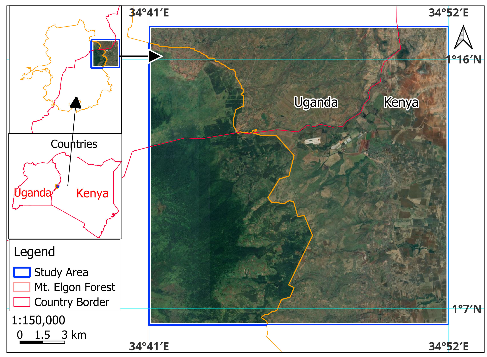
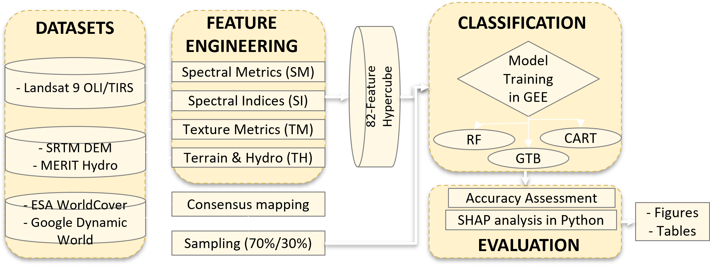

# Evaluating Spectral, Terrain, and Textural Predictors in LULC Mapping Using SHAP and Tree-Based Classifiers
### Suam LULC Analysis 2025: Explainable AI in Remote Sensing

## 1. Abstract
This paper assesses the predictive capacity of multi-source predictor variables on a heterogeneous landscape on the slopes of Mount Elgon using three tree-based models: Random Forest (RF), Gradient Tree Boosting (GTB), and Classification and Regression Trees (CART). A feature hypercube of 82 variables was derived from Landsat 9 OLI/TIRS, SRTM, and MERIT Hydro datasets. Feature importance was determined using **Shapley Additive exPlanations (SHAP)**. RF achieved the highest accuracy (94.7% OA), while GTB exhibited the lowest Quantity Disagreement (QD). SHAP results indicate that Spectral Metrics (SM) and Spectral Indices (SI) were the most dominant predictors for class separability, validating the significance of SHAP in enhancing transparency in LULC classification.

**Keywords:** Land Use Land Cover (LULC), Shapley Additive Explanations (SHAP), Feature importance, Google Earth Engine (GEE), Mount Elgon Forest.

---

## 2. Study Area
The study focuses on the **Suam region (40,000 ha)**, a transboundary landscape along the Kenyan-Ugandan border on the slopes of **Mount Elgon**.
* **Heterogeneity:** The area represents a complex transition from protected afro-montane forests to intensive agricultural and urbanized zones.
* **Topography:** High altitudinal variation, strongly influencing LULC patterns.

*Figure 1: Study area location and topographic context.*

---

## 3. Methodology & Feature Engineering

### The 82-Band Feature Hypercube
The study utilizes a robust feature engineering pipeline implemented in Google Earth Engine, categorizing predictors into four distinct groups:
1.  **Spectral Metrics (SM):** 30 bands (Percentiles from Landsat 9).
2.  **Spectral Indices (SI):** 40 bands (NDVI, NDBI, MNDWI, NBR, BSI, etc.).
3.  **Texture Metrics (TM):** 6 bands (GLCM Variance, Contrast, Entropy).
4.  **Terrain & Hydro (TH):** 6 bands (Elevation, Slope, Aspect, TWI, TPI, HAND).

*Figure 2: Workflow illustrating feature extraction, classification, and SHAP interpretability analysis.*

---

## 4. Explainable AI: SHAP Analysis
Unlike traditional GEE variable importance (which is model-specific and often biased), this study exports the sampled hypercube to Python to utilize **Shapley Additive exPlanations (SHAP)**. 

### Why SHAP?
SHAP provides a unified measure of feature importance by calculating the marginal contribution of each feature across all possible feature permutations, offering unparalleled transparency into *how* the tree-based models separate complex LULC classes.

*Note: SHAP summary plots and global importance CSVs are generated using the `shap_analysis.ipynb` notebook located in the `/scripts` directory.*

---

## 5. Repository Structure
* **`/scripts`**: 
    * `gee_feature_extraction.js`: Generates the 82-band stack and exports the training sample values.
    * `shap_analysis.ipynb`: Python code for calculating and visualizing SHAP values for RF, GTB, and CART.
* **`/data`**: 
    * `Suam_Training_Points_Region.csv`: The raw dataset extracted from GEE.
    * `global_shap_importance_*.csv`: The exported global SHAP values for each model.
* **`/images`**: Study area maps, workflows, and output SHAP summary plots.

---

## 6. Key Results
* **Overall Accuracy:** Random Forest (RF) outperformed others with **94.7% OA**, 0.92 Kappa, and 0.88 mF1.
* **Disagreement Analysis:** Gradient Tree Boosting (GTB) demonstrated the lowest Quantity Disagreement (QD), making it highly accurate for estimating class proportions.
* **Feature Dominance:** Across all three classifiers, SM and SI proved to be the most critical predictors for class separability based on SHAP global importance values.

---

## 7. Citation & Data Availability
All data, including the 82-band feature extractions and the Python SHAP pipeline, are openly available to ensure full reproducibility.

**Citation:** > *MJOMBA, L. (2025). Evaluating Spectral, Terrain, and Textural Predictors in LULC Mapping Using SHAP and Tree-Based Classifiers. [Conference Paper]*

Licensed under the **MIT License**.
